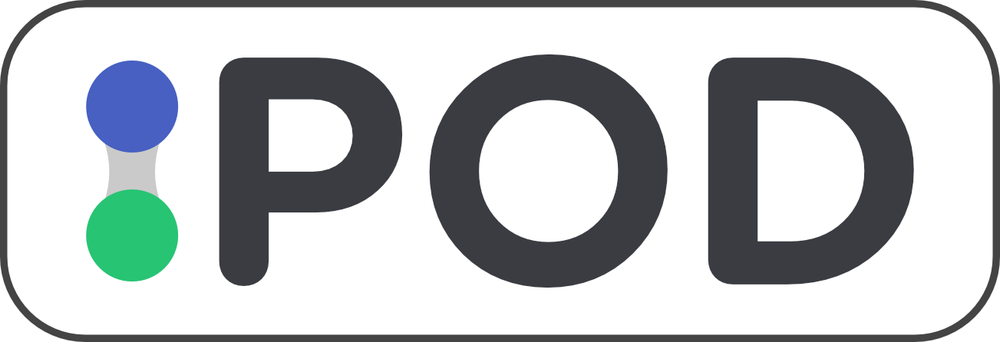

<p align="center"></p>

# POD

POD (placement online diary) is an application to allow students to keep track of their placement year.


## Run Locally

Clone the project

```bash
git clone git@github.com:angus-websites/pod.git
```

Go to the project directory

```bash
cd pod
```

Setup Laravel Sail

**_NOTE:_**  Ensure you have Docker installed

```bash
docker run --rm \
    -u "$(id -u):$(id -g)" \
    -v $(pwd):/var/www/html \
    -w /var/www/html \
    laravelsail/php81-composer:latest \
    composer install --ignore-platform-reqs
```

Generate a .env file

```bash
cp .env.example .env
```
Run Laravel Sail (Development server)

```bash
./vendor/bin/sail up
```

**Open a new Terminal tab in the same project root folder**

Generate an app encryption key

```bash
./vendor/bin/sail php artisan key:generate
```

Migrate the database

```bash
./vendor/bin/sail php artisan migrate
```

Seed the database tables

```bash
./vendor/bin/sail php artisan db:seed
```

Install npm dependencies

```bash
./vendor/bin/sail npm install
```

Run Vite

```bash
./vendor/bin/sail npm run dev
```

Visit [Localhost](http://localhost/)


## Authors

- [@angusgoody](https://github.com/angusgoody)

